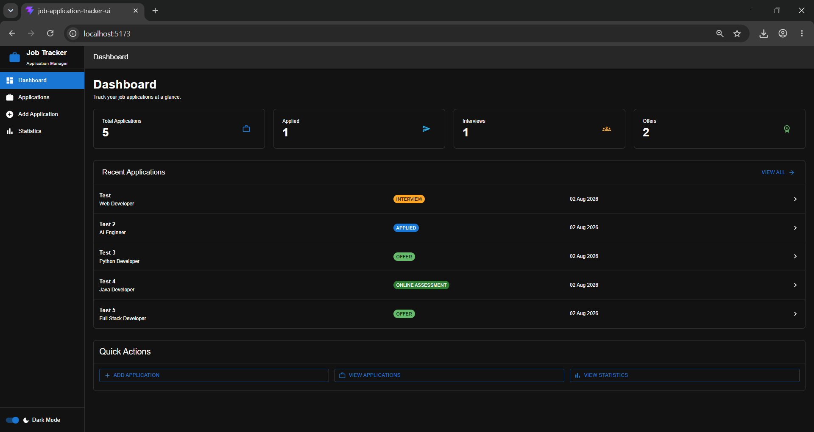
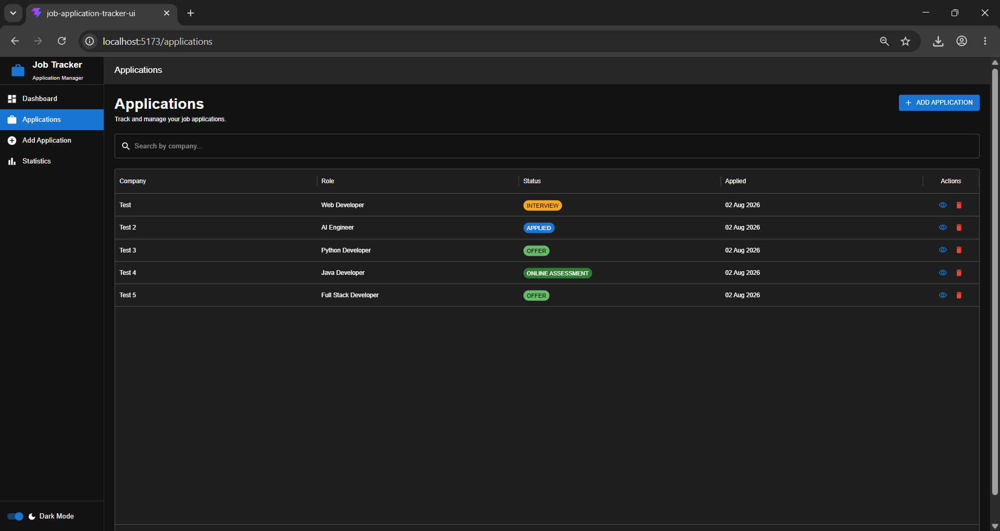
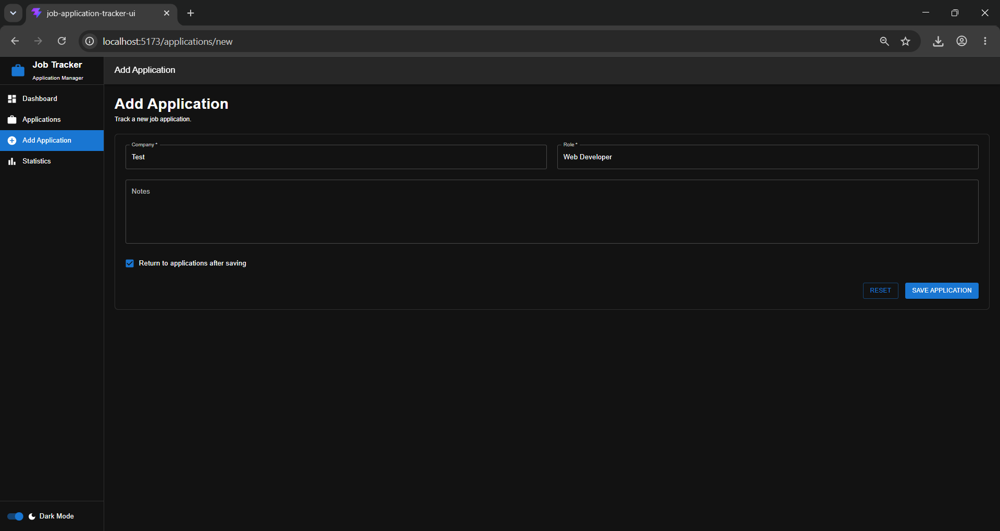
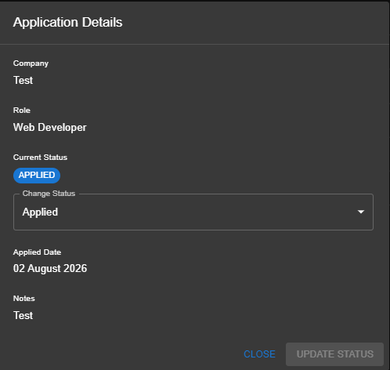
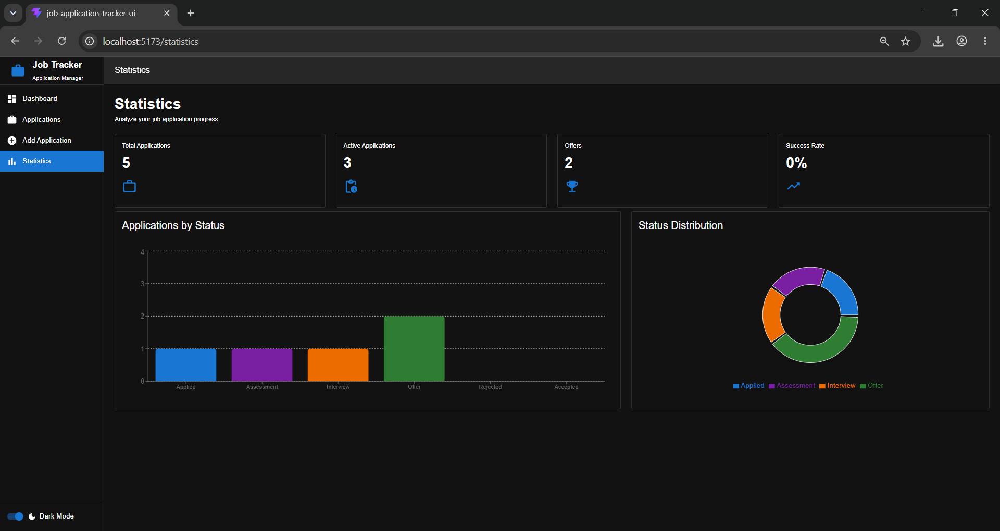

# Job Application Tracker UI

A modern React + TypeScript frontend for the Job Application Tracker application. It provides an intuitive interface for managing job applications, tracking application statuses, and visualizing application statistics through a responsive Material UI design.

## Features

- Dashboard with application summary cards
- Recent applications overview
- View application details
- Update application status
- Search applications by company
- Statistics dashboard with charts
- Responsive Material UI interface
- Dark/Light theme support
- REST API integration with Spring Boot backend

## Screenshots

### Dashboard

Provides a quick overview of your job search with summary cards and recently added applications.



---

### Applications

Browse, search, and update job applications from a single table.



---

### Add Application

Create and save a new job application with company, role, status, and other details.



---

### Edit Application Status

Edit the status of an existing application directly from the application details dialog.



---

### Statistics

Visualize application progress using charts and status breakdowns.



## Tech Stack

- React 19
- TypeScript
- Vite
- Material UI (MUI)
- React Router
- Axios
- React Hook Form
- Recharts

## Backend

This frontend consumes the Spring Boot REST API available here:

**Backend Repository:**  
https://github.com/SAHIL-VARTAK/Job-Application-Tracker

## Getting Started

### Prerequisites

- Node.js 20+
- npm

### Installation

```bash
npm install
```

### Run the development server

```bash
npm run dev
```

The application will be available at:

```
http://localhost:5173
```

## Available Scripts

```bash
npm run dev
```

Starts the development server.

```bash
npm run build
```

Builds the application for production.

```bash
npm run preview
```

Serves the production build locally.

```bash
npm run check
```

Runs project checks.

```bash
npm run check:fix
```

Automatically fixes supported issues.

## Running with Docker

### Prerequisites

- Docker Desktop installed and running
- Spring Boot backend running locally on port `8080`

### Build the Docker Image

Since the frontend is built using Vite, the backend API URL must be provided **at build time**.

```bash
docker build --build-arg VITE_API_BASE_URL=http://localhost:8080/api -t job-application-tracker-ui .
```

### Run the Container

```bash
docker run -p 5173:80 job-application-tracker-ui
```

Open the application in your browser:

```
http://localhost:5173
```

## Testing

This project includes a comprehensive automated test suite built with **Vitest** and **React Testing Library**, covering components, pages, hooks, services, utilities, and application workflows.

### Run Tests

```bash
npm test
```

Runs the test suite in watch mode.

```bash
npm run test:run
```

Runs the complete test suite once.

### Generate Coverage Report

```bash
npm run test:coverage
```

Generates a code coverage report for the `src` directory.

### Test Stack

- Vitest
- React Testing Library
- JSDOM
- @testing-library/user-event
- @testing-library/jest-dom

### Coverage

The project is configured to collect coverage for the application source code (`src`) using the V8 coverage provider. Reports are generated in multiple formats, including:

- Terminal summary
- HTML report
- LCOV report (for CI integration)

The HTML coverage report can be viewed after running:

```bash
npm run test:coverage
```

Then open:

```
coverage/index.html
```

### Notes

- `VITE_API_BASE_URL` is embedded into the application during the Vite build process.
- Any changes to the API URL require rebuilding the Docker image.
- The `.env` file is intentionally excluded from the Docker image using `.dockerignore`.
- The API URL is supplied securely using the Docker build argument:
  ```bash
  --build-arg VITE_API_BASE_URL=http://localhost:8080/api
  ```
- In a future Docker Compose setup, the frontend and backend will communicate over a shared Docker network without relying on `localhost`.
